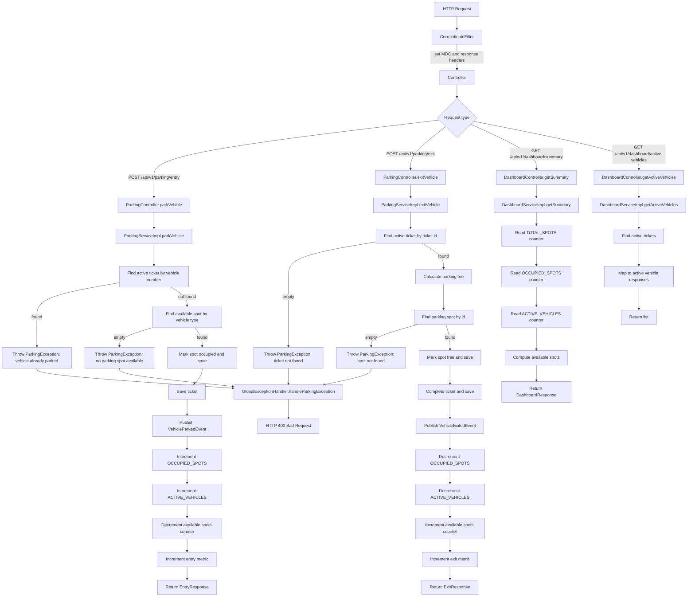

# Parking Lot Code Flow Diagram

This document contains the request flow for the Parking Lot Management System.

## Mermaid Flowchart

## Notes

- `CorrelationIdFilter` adds trace metadata before the request reaches controllers.
- `ParkingController` and `DashboardController` delegate business logic to services.
- `ParkingServiceImpl` handles both entry and exit scenarios with event publishing and cache updates.
- `DashboardServiceImpl` uses Redis counters for fast summary responses.
- `GlobalExceptionHandler` converts `ParkingException` into `HTTP 400 Bad Request` responses.
