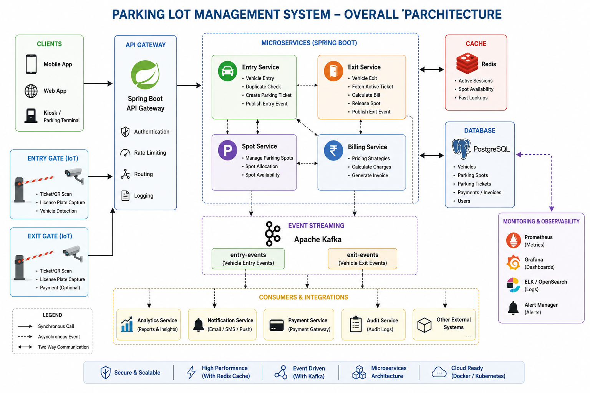

# 🚗 Parking Lot Management System

A production-style Parking Lot Management System built using Spring Boot, PostgreSQL, Redis, Kafka, JPA, and Design Patterns.

The application manages vehicle parking, spot allocation, fee calculation, vehicle exits, dashboard statistics, caching, event publishing, logging, and monitoring-ready architecture.

---

# Business Problem

Parking management systems must efficiently:

* Allocate parking spots
* Prevent duplicate vehicle entries
* Calculate parking charges
* Release spots during exit
* Maintain real-time parking inventory
* Provide dashboard visibility
* Publish parking events for downstream systems

This project simulates a real-world parking management platform.

---

# Features

## Vehicle Entry

* Allocate parking spot
* Create parking ticket
* Publish Kafka event
* Update Redis counters

## Vehicle Exit

* Calculate parking fee
* Release parking spot
* Update ticket status
* Publish Kafka event
* Update Redis counters

## Dashboard

* Total Spots
* Occupied Spots
* Available Car Spots
* Available Bike Spots
* Available Truck Spots
* Active Vehicles

## Redis Caching

* Occupied Spots
* Active Vehicles
* Available Car Spots
* Available Bike Spots
* Available Truck Spots

## Kafka Event Streaming

Vehicle Parked Event

Vehicle Exited Event

## Logging

* Correlation Id
* Session Id
* User Id
* Structured logs

## Monitoring Ready

* Actuator compatible
* JaCoCo coverage reports
* Kafka metrics
* Redis metrics

---

# Technology Stack

| Layer            | Technology      |
| ---------------- | --------------- |
| Language         | Java 21         |
| Framework        | Spring Boot 3.5 |
| Build Tool       | Maven           |
| Database         | PostgreSQL      |
| Cache            | Redis           |
| Messaging        | Kafka           |
| ORM              | Spring Data JPA |
| Logging          | SLF4J + Logback |
| Unit Testing     | JUnit 5         |
| Mocking          | Mockito         |
| Coverage         | JaCoCo          |
| API Testing      | Curl / Postman  |
| Containerization | Docker Ready    |

---

# Design Patterns Used

## Strategy Pattern

Fee calculation based on vehicle type.

* CarFeeStrategy
* BikeFeeStrategy
* TruckFeeStrategy

## Repository Pattern

Data access abstraction.

* TicketRepository
* ParkingSpotRepository

## Producer Consumer Pattern

Kafka Event Producer and Consumer.

---

# Project Structure

```text
src/main/java/com/rahulsmgv/parkinglot

controller/
service/
service/impl/
service/pricing/
repository/
entity/
dto/
exception/
kafka/
config/
util/
```

---

# Database Schema

## parking_spot

| Column       | Type    |
| ------------ | ------- |
| id           | bigint  |
| spot_no      | varchar |
| vehicle_type | varchar |
| occupied     | boolean |

## ticket

| Column         | Type      |
| -------------- | --------- |
| id             | bigint    |
| ticket_id      | varchar   |PRIMARY KEY
| vehicle_number | varchar   |
| vehicle_type   | varchar   |
| spot_id        | bigint    |
| entry_time     | timestamp |
| exit_time      | timestamp |
| amount         | decimal   |
| status         | varchar   |

## 

vehicle
-------
id
vehicle_number
vehicle_type
first_seen
last_seen

---

# Prerequisites

Install:

* Java 21
* Maven
* PostgreSQL
* Redis
* Kafka

Verify:

```bash
java -version
mvn -version
psql --version
redis-cli ping
kafka-topics.sh --version
```

---

# Application Configuration

application.properties

```properties
spring.datasource.url=jdbc:postgresql://localhost:5432/postgres

spring.datasource.username=postgres

spring.datasource.password=mysecretpassword

spring.jpa.hibernate.ddl-auto=update

spring.kafka.bootstrap-servers=localhost:9092

spring.data.redis.host=localhost
spring.data.redis.port=6379
```

---

# Build Project

```bash
mvn clean install
```

---

# Run Application

```bash
mvn spring-boot:run
```

Application starts on:

```text
http://localhost:8080
```

---

# API Documentation

## Vehicle Entry

### Request

```bash
curl -X POST http://localhost:8080/api/v1/parking/entry \
-H "Content-Type: application/json" \
-d '{
  "vehicleNumber":"UP32AB1234",
  "vehicleType":"CAR"
}'
```

### Response

```json
{
  "ticketId":"98a4c894-9cfd-4459-a097-c5614a8561b9",
  "spotNo":"C-01",
  "entryTime":"2026-06-14T15:00:00"
}
```

---

## Vehicle Exit

### Request

```bash
# Option A: Alias endpoint (send ticketId in JSON body)
curl -X POST http://localhost:8080/api/v1/exit \
  -H "Content-Type: application/json" \
  -d '{
    "ticketId":"98a4c894-9cfd-4459-a097-c5614a8561b9"
  }'

# Option B: Path variable endpoint (no request body)
curl -X POST http://localhost:8080/api/v1/parking/exit/98a4c894-9cfd-4459-a097-c5614a8561b9
```

### Response

```json
{
  "ticketId":"98a4c894-9cfd-4459-a097-c5614a8561b9",
  "vehicleNumber":"UP32AB1234",
  "parkingFee":40.0,
  "entryTime":"2026-06-14T15:00:00",
  "exitTime":"2026-06-14T17:00:00"
}
```

---

## Dashboard

### Request

```bash
curl http://localhost:8080/api/v1/dashboard/summary
```

### Response

```json
{
  "totalSpots":30,
  "occupiedSpots":4,
  "availableCarSpots":8,
  "availableBikeSpots":12,
  "availableTruckSpots":6
}
```

---

## Active Vehicles

### Request

```bash
curl http://localhost:8080/api/v1/dashboard/active-vehicles
```

### Response

```json
[
  {
    "ticketId":"123",
    "vehicleNumber":"UP32AB1234"
  }
]
```

## Example Test Cases

### Vehicle Entry APIs

#### Case 1: Valid CAR Entry

```bash
curl -X POST http://localhost:8080/api/v1/parking/entry \
  -H "Content-Type: application/json" \
  -d '{
    "vehicleNumber":"UP32AB1234",
    "vehicleType":"CAR"
  }'
```

Expected:

```json
{
  "ticketId":"uuid",
  "spotNo":"C-01",
  "entryTime":"2026-06-14T15:00:00"
}
```

#### Case 2: Valid BIKE Entry

```bash
curl -X POST http://localhost:8080/api/v1/parking/entry \
  -H "Content-Type: application/json" \
  -d '{
    "vehicleNumber":"UP32BIKE01",
    "vehicleType":"BIKE"
  }'
```

#### Case 3: Valid TRUCK Entry

```bash
curl -X POST http://localhost:8080/api/v1/parking/entry \
  -H "Content-Type: application/json" \
  -d '{
    "vehicleNumber":"UP32TRUCK01",
    "vehicleType":"TRUCK"
  }'
```

### Validation Cases

#### Case 4: Vehicle Number Missing

```bash
curl -X POST http://localhost:8080/api/v1/parking/entry \
  -H "Content-Type: application/json" \
  -d '{
    "vehicleType":"CAR"
  }'
```

Expected:

```json
{
  "message":"Vehicle number is mandatory"
}
```

#### Case 5: Vehicle Type Missing

```bash
curl -X POST http://localhost:8080/api/v1/parking/entry \
  -H "Content-Type: application/json" \
  -d '{
    "vehicleNumber":"UP32AB1234"
  }'
```

Expected:

```json
{
  "message":"Vehicle type is mandatory"
}
```

#### Case 6: Empty Vehicle Number

```bash
curl -X POST http://localhost:8080/api/v1/parking/entry \
  -H "Content-Type: application/json" \
  -d '{
    "vehicleNumber":"",
    "vehicleType":"CAR"
  }'
```

#### Case 7: Invalid Vehicle Type

```bash
curl -X POST http://localhost:8080/api/v1/parking/entry \
  -H "Content-Type: application/json" \
  -d '{
    "vehicleNumber":"UP32AB1234",
    "vehicleType":"BUS"
  }'
```

Expected:

```json
{
  "message":"Invalid vehicle type"
}
```

### Business Rule Cases

#### Case 8: Duplicate Entry

```bash
curl -X POST http://localhost:8080/api/v1/parking/entry \
  -H "Content-Type: application/json" \
  -d '{
    "vehicleNumber":"UP32AB1234",
    "vehicleType":"CAR"
  }'
```

Expected:

```json
{
  "message":"Vehicle already parked"
}
```

Status: `409 CONFLICT`

#### Case 9: Parking Full

Fill all spots first, then:

```bash
curl -X POST http://localhost:8080/api/v1/parking/entry \
  -H "Content-Type: application/json" \
  -d '{
    "vehicleNumber":"UP32FULL01",
    "vehicleType":"CAR"
  }'
```

Expected:

```json
{
  "message":"No parking spot available"
}
```

### Vehicle Exit APIs

#### Case 10: Valid Exit

```bash
curl -X POST http://localhost:8080/api/v1/exit \
  -H "Content-Type: application/json" \
  -d '{
    "ticketId":"TICKET_ID"
  }'
```

Expected:

```json
{
  "ticketId":"TICKET_ID",
  "vehicleNumber":"UP32AB1234",
  "parkingFee":40.0,
  "entryTime":"...",
  "exitTime":"..."
}
```

#### Case 11: Invalid Ticket

```bash
curl -X POST http://localhost:8080/api/v1/exit \
  -H "Content-Type: application/json" \
  -d '{
    "ticketId":"INVALID"
  }'
```

Expected:

```json
{
  "message":"Ticket not found"
}
```

#### Case 12: Empty Ticket ID

```bash
curl -X POST http://localhost:8080/api/v1/exit \
  -H "Content-Type: application/json" \
  -d '{
    "ticketId":""
  }'
```

#### Case 13: Null Ticket ID

```bash
curl -X POST http://localhost:8080/api/v1/exit \
  -H "Content-Type: application/json" \
  -d '{}'
```

#### Case 14: Double Exit

Exit the same ticket twice:

```bash
curl -X POST http://localhost:8080/api/v1/parking/exit/{ticketid} \
  -H "Content-Type: application/json" \
  -d '{
    "ticketId":"TICKET_ID"
  }'
```

Expected:

```json
{
  "message":"Ticket not found"
}
```

or

```json
{
  "message":"Ticket already closed"
}
```

### Dashboard APIs

#### Case 15: Get Dashboard

```bash
curl http://localhost:8080/api/v1/dashboard/summary
```

Expected:

```json
{
  "totalSpots":30,
  "occupiedSpots":4,
  "availableCarSpots":8,
  "availableBikeSpots":12,
  "availableTruckSpots":6
}
```

#### Case 16: Active Vehicles

```bash
curl http://localhost:8080/api/v1/dashboard/active-vehicles
```

Expected:

```json
[
  {
    "ticketId":"...",
    "vehicleNumber":"UP32AB1234"
  }
]
```

### Concurrency Test

Duplicate requests at the same time:

```bash
for i in {1..20}
do
  curl -X POST http://localhost:8080/api/v1/parking/entry \
    -H "Content-Type: application/json" \
    -d '{
      "vehicleNumber":"UP32CONCURRENT",
      "vehicleType":"CAR"
    }' &
done
wait
```

Expected:

* Only one ticket created
* All other requests return:

```json
{
  "message":"Vehicle already parked"
}
```

### Load Test (100 Requests)

```bash
for i in {1..100}
do
  curl -X POST http://localhost:8080/api/v1/parking/entry \
    -H "Content-Type: application/json" \
    -d "{
      \"vehicleNumber\":\"CAR$i\",
      \"vehicleType\":\"CAR\"
    }" &
done
wait
```

---

# Functional Test Scenarios

## Entry

* Valid CAR Entry
* Valid BIKE Entry
* Valid TRUCK Entry
* Duplicate Vehicle Entry
* Parking Full
* Missing Vehicle Number
* Missing Vehicle Type
* Invalid Vehicle Type

## Exit

* Valid Exit
* Invalid Ticket
* Empty Ticket
* Null Ticket
* Double Exit

## Dashboard

* Dashboard Summary
* Active Vehicles

## Concurrency

* Simultaneous Entry Requests
* Simultaneous Exit Requests

---

# Redis Keys

```text
occupied_spots

active_vehicles

available_car_spots

available_bike_spots

available_truck_spots
```

---

# Kafka Events

## Vehicle Parked Event

```json
{
  "ticketId":"123",
  "vehicleNumber":"UP32AB1234",
  "spotNo":"C-01"
}
```

## Vehicle Exited Event

```json
{
  "ticketId":"123",
  "vehicleNumber":"UP32AB1234",
  "parkingFee":40
}
```

---

# Unit Testing

Run tests:

```bash
mvn test
```

---

# JaCoCo Coverage

Generate coverage report:

```bash
mvn clean test jacoco:report
```

Report Location:

```text
target/site/jacoco/index.html
```

Open Report:

```bash
xdg-open target/site/jacoco/index.html
```

---

## Swagger UI

http://localhost:8080/swagger-ui.html

## Prometheus

http://localhost:9090

## Grafana

http://localhost:3000

---

